# afsal - Angry Fruit Salad

Set ANSI color and text attribute escape codes for text using regular expressions.

### Requirements

* Python 3 or higher (Python 2 is not supported)
* python3-setuptools

### Installation

In the afsal/ directory, execute the following:

 ```bash
 python3 setup.py build
 python3 setup.py install # You might need to sudo this command.
 ```

afsal should now be put into /usr/local/bin/, or equivalent. If you are not able to execute the program globally, you might need to change the access rights (using *chmod*) of these two files:
* /usr/local/bin/afsal (or wherever it was installed - check the output from the install command above)
* /usr/local/lib/python3.4/dist-packages/afsal-0.1.0-py3.4.egg (or equivalent - check the output from the install command above)

If you want a customized installation, check the installation options by running this command:
 ```bash
 python3 setup.py --help
 ```

### Description

This program reads in text data, either piped in or from positional argument(s), or both. If more than one stream is given to the program, it will concatenate them, in the order that they arrived. Stdin directed to the program will be put before the file(s) given as positional argument(s).

The user must provide one or more (regular expression, color/text attribute) pair(s) to the program. The program will go through the text on a line-per-line basis and assign the color/text attribute to its corresponding regular expression match(es) in each line of the text. The text provided with ANSI escape codes is then sent to stdout.

The regular expression part of the pair must adhere to the Perl style of regular expressions. The color/text attribute part must be of this form:

    [b AND/OR d AND/OR i AND/OR u][foreground color OR background color]

Foreground and background color activation and deactivation follow these rules:
* If color A and color B are overlapping and if B has a later starting position than A, then A will be suppressed in the interval where B is being expressed.
* In the case above, if A has an endpoint that comes after the endpoint of B, A will be re-expressed when B terminates.

Text attributes (bold, dim, italic, and underlined) are simply activated for as long as at least one attribute of the given type has part of a match in the given location.

Multiprocessing is used by default if the number of processor cores on the machine exceeds 1 and the number of processes to spawn is by default the same as the number of processor cores on the machine. The user can change the number of processes to spawn, as well as disable multiprocessing.

If the number of lines of the text provided is below a certain limit, multiprocessing will not be used. This limit can be set by the user.

The program generates at startup the configuration file ~/.afsal with default values, if such a file does not already exist. The user can modify this file to avoid having to tweak the settings repeatedly with flags.

For details about how to use the program, execute this command:
 ```bash
 afsal -h
 ```

### Tutorial

Let's assume we have the following text file that we want to transform into an angry fruit salad.

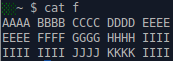

We execute *afsal* with the *-p* flag in order to see all color possibilities for our terminal (this one is capable of 256 colors).

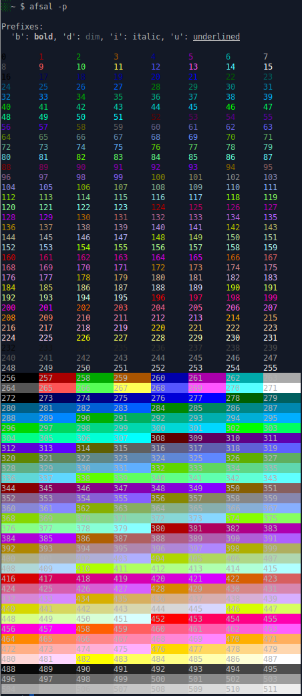

Color numbers [0, 255] are foreground colors, while [256, 511] are background colors and these are handled separately and can be activated independently from each other, but more on this later.

Number 42 is a nice color, isn't it? Let's start with coloring \"AAAA\" with foreground color 42.

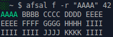

And now we color \"IIII\" with background color 482.

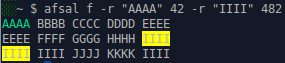

As expected, or is it? Obviously, the regular expression is not used globally, which is why only the first instance of \"IIII\" is colored on the third line.

In order to execute a global regular expression, you use the *-g* flag instead of the *-r* flag. Global regular expressions can also be set to be the default for all regular expression searches by using the *--glob* flag, or by setting the configuration value *globalregexps* to *True* in the afsal configuration file *~/.afsal*.

Let's now try using the *-g* flag.

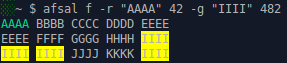

Nice, now we got everyone of those I:s included in our angry fruit salad.

As stated previously, foreground and background colors live their own lives and are activated separately. The foreground color of those I:s are looking rather bleak right now, so let's change them.

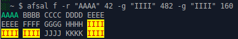

One important thing to be aware of is that a subsequent regular expression match will become dominant when overlapping with a previous match of the same type (foreground or background color).

In this example, the two last characters of \"AAAA\" are part of two matches and the color of the last match is therefore used for these two characters. The color of the first match is suppressed.

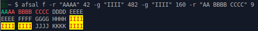

A match encapsulating a subsequent match turned dominant, meaning that its endpoint surpasses the endpoint of the subsequent match, will be re-enabled when the subsequent match is terminated, as demonstrated in this example. This goes for both foreground and background colors.

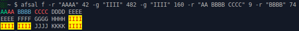

That pretty much sums up foreground and background color behavior.

The text attributes *bold*, *dim*, *italic*, and *underlined* are supported in this program, but their behavior is different, since they are binary rather than 8-ary or 256-ary. A text attribute will be active for as long as there is any match for them at the given point. Text attributes are activated independently of each other and they will be colored if they overlap with any foreground or background color match - no deviation from the usual behavior, in other words.

Let's start out by making the whole first line bold.

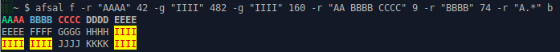

...And part of the second line underlined.

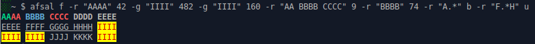

I guess this goes without saying, but it doesn't hurt to mention it nonetheless. A text attribute match that overlaps part of the previous text attribute match of the same type and then extends beyond the previous match's endpoint, will have the effect of extending the matched segment. See this example.

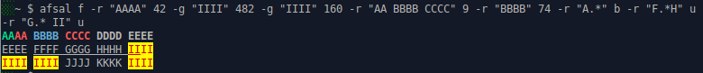

You get the idea. *dim* and *italic* works in the very same way as *bold* and *underlined* - the keyword for *dim* being \'d\' and the keyword for *italic* being \'i\'.

Text attributes can be combined with each other and with either a foreground color or a background color. Let's put it to the test and make something wild out of the J:s and K:s.

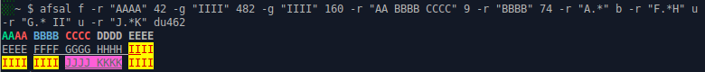

So, now we colored \"JJJJ KKKK\" with the background color 462 and set the text attributes for it to be *dim* and *underlined*.

The end.

### Multiprocessing characteristics

I did a quick and simple test on an Intel Core i5-4670K CPU at 3.40 GHz with 4 cores, testing the program with 1, 2, 3, 4, 6, 8, and 16 processes. For each number of processes, I did three runs and then took the average time values.

The program received a text file of size 80 MB as input and I gave it six simple regular expressions to solve.

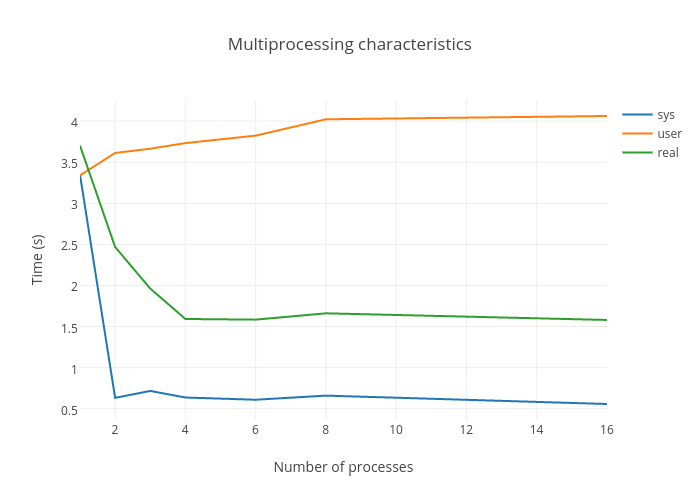

The program will default to use the number of processor cores existing on the given machine, unless the user disables multiprocessing or sets a number of processes to use manually, and this seems reasonable based on these results.
